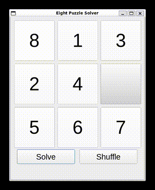

# Eight Puzzle Solver

A Python-based Eight Puzzle Solver with a graphical interface using PyQt5. This project demonstrates the application of the A* search algorithm to find the optimal solution for the classic 8-puzzle problem.

## Description

The Eight Puzzle Solver allows users to visualize the process of solving the 8-puzzle problem. The project integrates complex algorithms with a user-friendly interface, providing real-time feedback and a visual representation of the puzzle's solution.

## Features

- **A* Algorithm**: Uses the A* search algorithm to find the best solution.
- **Real-Time Timer**: Tracks the time taken to solve the puzzle with millisecond precision.
- **Visual Puzzle Movement**: Displays the movement of puzzle pieces as the solution is applied.
- **Fixed Window Size (In Progress)**: Ensures a non-resizable, perfectly aligned interface.

## Installation

To run the Eight Puzzle Solver on your local machine, follow these steps:

1. **Clone the repository:**
    ```bash
    git clone https://github.com/sminerport/8PuzzleSolver.git
    ```
2. **Navigate to the project directory:**
    ```bash
    cd EightPuzzleSolver
    ```
3. **Install the required dependencies:**
    ```bash
    pip install -r requirements.txt
    ```

## Usage

To start the Eight Puzzle Solver, run:

```bash
python main.py
```

Once started, you can use the **Shuffle** button to randomize the puzzle and the **Solve** button to watch the A* algorithm in action.

## Demo



## Technologies Used

- **Python**
- **PyQt5**
- **SimpleAI**

## Contributing

Contributions are welcome! Please open an issue or submit a pull request with your improvements.

## License

This project is licensed under the MIT License - see the [LICENSE](LICENSE) file for details.

## Contact

For any questions, feel free to contact me:

- **GitHub**: [sminerport](https://github.com/sminerport)
- **Email**: scott.miner.data.scientist@gmail.com
